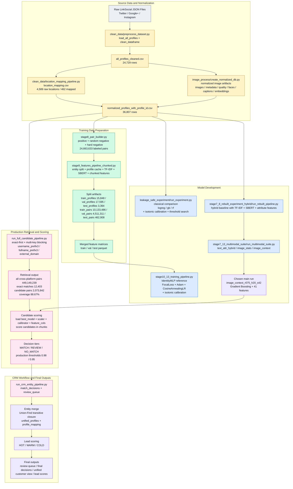
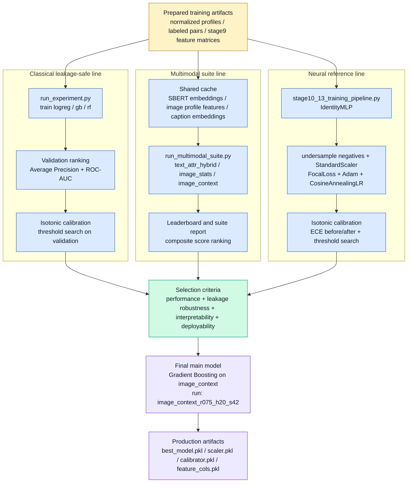

# Pipeline ล่าสุดจริงที่สอดคล้องกับโค้ดปัจจุบัน

เอกสารนี้ใช้แทนภาพ plan เดิมในกรณีที่ต้องการให้รูปประกอบในรายงานตรงกับ implementation ล่าสุดของโครงการจริง โดยยึดเส้นหลักจากโค้ดปัจจุบัน ได้แก่ `preprocess_dataset.py`, `location_mapping_pipeline.py`, `create_normalized_db.py`, `stage8_pair_builder.py`, `stage9_features_pipeline_chunked.py`, `run_rebuilt_pipeline.py`, `run_multimodal_suite.py`, `stage10_13_training_pipeline.py`, `run_full_candidate_pipeline.py` และ `run_crm_entity_pipeline.py`

## รูปที่ 3.2 เวอร์ชันล่าสุดจริง: End-to-End Pipeline

คำอธิบายใต้ภาพที่ควรใช้  
แสดงลำดับการทำงานของระบบล่าสุดที่สอดคล้องกับโค้ดปัจจุบัน ตั้งแต่การนำเข้าข้อมูลดิบ การสร้าง artifact มาตรฐาน การสร้างคู่ข้อมูล การสร้าง feature matrix การเปรียบเทียบโมเดล การเลือก final model การคัด candidate pairs ในระดับ production ไปจนถึงการรวมเอนทิตีและการให้คะแนน lead ในระบบ CRM

## รูปที่ 3.6 เวอร์ชันล่าสุดจริง: Model Development Pipeline

คำอธิบายใต้ภาพที่ควรใช้  
แสดงกระบวนการพัฒนาแบบจำลองล่าสุดของระบบ โดยแยกบทบาทของสาย classical comparison, multimodal suite และ neural reference ออกจากกันอย่างชัดเจน พร้อมแสดงจุดที่มีการทำ calibration, threshold selection และการเลือก final model สำหรับ production pipeline

## หมายเหตุสำคัญในการใช้รูปนี้ในรายงาน

1. รูปนี้สะท้อน implementation ล่าสุดจริง ไม่ใช่ roadmap เวอร์ชันแรก
2. หากต้องการอ้างการทดลองตามแผนเดิม ควรใช้คำว่า “แผนการพัฒนาเบื้องต้น” หรือ “initial implementation roadmap”
3. หากต้องการอธิบาย final pipeline ของงาน ควรใช้รูปชุดนี้แทนภาพเดิมที่ยังมี `LSH/SimHash`, `cross-modal attention` และ `OpenFace-heavy branch` เป็นแกนหลัก
